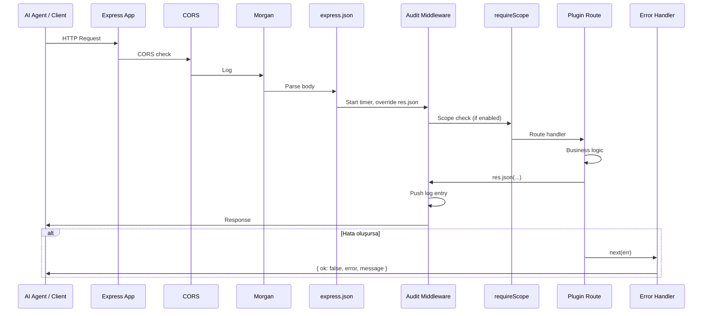
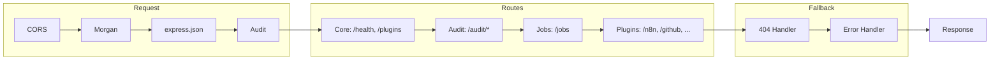
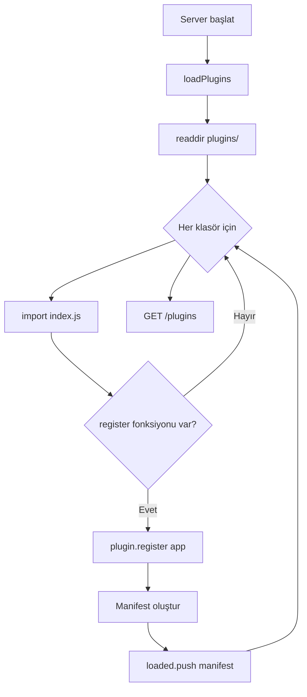
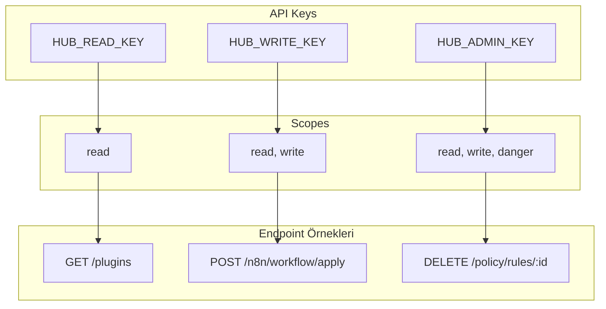
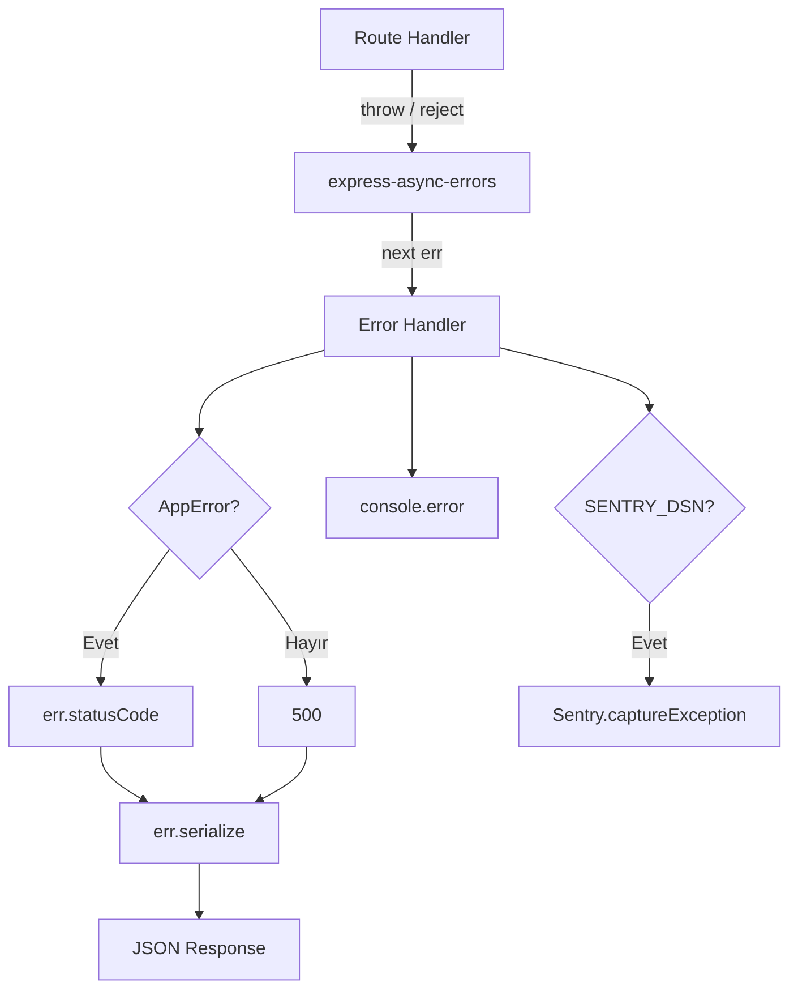
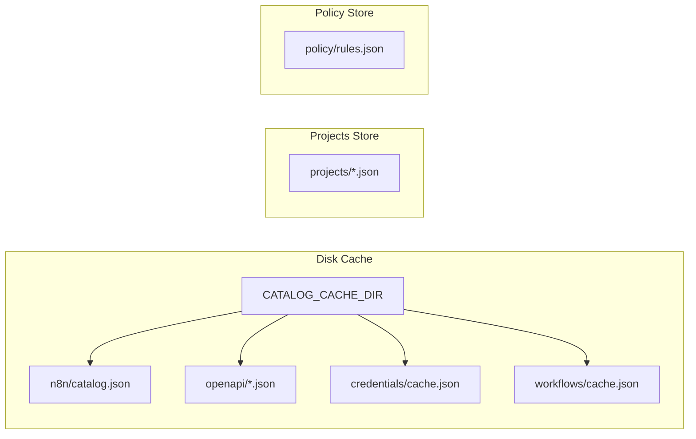
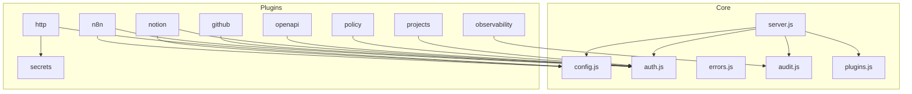

# MCP-Hub Mimari Dokümantasyonu

> AI agent'lar için plugin tabanlı HTTP bilgi ve aksiyon servisi.

---

## 1. Genel Bakış

MCP-Hub, n8n, Cursor veya herhangi bir LLM ortamında çalışan AI agent'ların harici servislere **yapılandırılmış erişim** sağlaması için tasarlanmış bir köprü servistir. LLM çağrısı yapmaz; sadece REST API üzerinden veri sunar ve aksiyonları yürütür.

```
┌─────────────────────────────────────────────────────────────────────────────┐
│                        AI Agent (n8n / Cursor / CLI)                         │
│  • HTTP Request Tool ile mcp-hub endpoint'lerini çağırır                     │
│  • JSON yanıtları alır, workflow/proje planı oluşturur                      │
└─────────────────────────────────────────────┬───────────────────────────────┘
                                              │ HTTP
                                              ▼
┌─────────────────────────────────────────────────────────────────────────────┐
│                              MCP-Hub (Express)                               │
│  • CORS, JSON, Audit, Auth middleware                                        │
│  • Plugin-based routing                                                     │
└─────────────────────────────────────────────┬───────────────────────────────┘
                                              │
                    ┌─────────────────────────┼─────────────────────────┐
                    │                         │                         │
                    ▼                         ▼                         ▼
┌───────────────────────┐   ┌───────────────────────┐   ┌───────────────────────┐
│   n8n Ecosystem       │   │   External Tools      │   │   Altyapı             │
│   • n8n               │   │   • github             │   │   • http              │
│   • n8n-credentials   │   │   • notion             │   │   • openapi           │
│   • n8n-workflows     │   │   • projects           │   │   • secrets           │
└───────────────────────┘   └───────────────────────┘   │   • policy            │
                                                          │   • observability     │
                                                          └───────────────────────┘
```

---

## 2. Dizin Yapısı

```
mcp-server/
├── src/
│   ├── index.js                 # Giriş noktası, process handlers
│   └── core/
│       ├── server.js            # Express app, middleware, route sırası
│       ├── plugins.js           # Plugin discovery & loader
│       ├── config.js            # Ortam değişkenleri
│       ├── auth.js              # RBAC (requireScope)
│       ├── audit.js             # İstek loglama
│       ├── errors.js            # AppError, NotFoundError, ValidationError
│       └── jobs.js              # Bellek tabanlı job queue
│
└── src/plugins/
    ├── database/                # MSSQL, PostgreSQL, MongoDB
    ├── file-storage/            # S3, Google Drive, local
    ├── github/                  # GitHub API
    ├── http/                    # Kontrollü HTTP istekleri
    ├── n8n/                     # Node catalog, workflow validate/apply
    ├── n8n-credentials/         # Credential metadata
    ├── n8n-workflows/            # Workflow listesi, arama
    ├── notion/                  # Notion sayfa, database, task
    ├── observability/            # Health, metrics, logs
    ├── openapi/                 # OpenAPI spec yükleme, kod üretimi
    ├── policy/                  # Kural motoru, onay kuyruğu
    ├── projects/                # Multi-project config registry
    └── secrets/                 # Secret ref sistemi
```

---

## 3. İstek Akışı



---

## 4. Middleware Sırası



| Sıra | Middleware | Açıklama |
|------|------------|----------|
| 1 | `cors()` | Cross-origin isteklere izin |
| 2 | `morgan("dev")` | HTTP logları |
| 3 | `express.json()` | Body parsing |
| 4 | `auditMiddleware` | Her isteği logla, `res.json` override |
| 5 | Route handlers | Core, audit, jobs, plugins |
| 6 | 404 handler | `NotFoundError` |
| 7 | Error handler | Tutarlı `{ ok, error, message }` formatı |

---

## 5. Plugin Sistemi

### 5.1 Plugin Kontratı

Her plugin `src/plugins/<name>/index.js` içinde şu export'ları sağlar:

```javascript
export const name = "my-plugin";
export const version = "1.0.0";
export const description = "...";
export const capabilities = ["read", "write"];
export const endpoints = [{ method: "GET", path: "/my/endpoint", description: "..." }];
export const requires = ["ENV_VAR"];

export function register(app) {
  const router = Router();
  router.get("/endpoint", requireScope("read"), handler);
  app.use("/my", router);
}
```

### 5.2 Plugin Yükleme Akışı



### 5.3 Plugin Listesi

| Plugin | Prefix | Capabilities | Açıklama |
|--------|--------|--------------|----------|
| **github** | `/github` | read | Repo listesi, analiz, tree, commit, issue |
| **http** | `/http` | write | Allowlist, rate limit, cache ile kontrollü HTTP |
| **n8n** | `/n8n` | read, write | Node catalog, context, validate, apply |
| **n8n-credentials** | `/credentials` | read | Credential metadata (secret yok) |
| **n8n-workflows** | `/n8n/workflows` | read | Workflow listesi, detay, arama |
| **notion** | `/notion` | read, write | Sayfa, database, proje, task |
| **observability** | `/observability` | read | Health, Prometheus metrics, error log |
| **openapi** | `/openapi` | read, write | Spec yükleme, endpoint analizi, n8n/curl/fetch örneği |
| **policy** | `/policy` | read, write | Kural motoru, onay kuyruğu |
| **projects** | `/projects` | read, write | Multi-project, multi-env config |
| **secrets** | `/secrets` | read, write | Secret ref `{{secret:NAME}}` çözümleme |

---

## 6. Kimlik Doğrulama ve RBAC



| Key | Scopes | Kullanım |
|-----|--------|----------|
| `HUB_READ_KEY` | read | Okuma endpoint'leri |
| `HUB_WRITE_KEY` | read, write | Yazma işlemleri |
| `HUB_ADMIN_KEY` | read, write, danger | Tehlikeli işlemler (silme, onay) |

**Hiç key tanımlı değilse** → Açık mod (tüm endpoint'ler erişilebilir).

---

## 7. Hata Yönetimi



---

## 8. Cache ve Depolama



| Plugin | Cache Konumu | TTL |
|--------|--------------|-----|
| n8n | `{cache}/n8n/` | CATALOG_TTL_HOURS |
| openapi | `{cache}/openapi/` | Kalıcı |
| n8n-credentials | `{cache}/credentials/` | CREDENTIALS_TTL_MINUTES |
| n8n-workflows | `{cache}/workflows/` | WORKFLOWS_TTL_MINUTES |
| projects | `{cache}/projects/` | Kalıcı |
| policy | Bellek | — |

---

## 9. Veri Akışı Örnekleri

### 9.1 n8n Workflow Oluşturma

```
AI Agent                    MCP-Hub                         n8n
    │                           │                           │
    │  POST /n8n/context         │                           │
    │  {nodes: "webhook,slack"}  │                           │
    │  ────────────────────────>│                           │
    │                           │  Cache'den node schema     │
    │                           │  Cache'den credentials      │
    │  {nodes, credentials,     │                           │
    │   examples}                │                           │
    │  <────────────────────────│                           │
    │                           │                           │
    │  POST /n8n/workflow/validate                           │
    │  {workflowJson}            │                           │
    │  ────────────────────────>│                           │
    │  {ok: true, warnings}     │                           │
    │  <────────────────────────│                           │
    │                           │                           │
    │  POST /n8n/workflow/apply  │  POST /api/v1/workflows   │
    │  {workflowJson, mode}     │  ────────────────────────>│
    │  ────────────────────────>│  {id, name}               │
    │  {ok, id, name}           │  <────────────────────────│
    │  <────────────────────────│                           │
```

### 9.2 GitHub + Notion Proje Planı

```
AI Agent                    MCP-Hub                    GitHub / Notion
    │                           │                           │
    │  GET /github/repos        │  GET /user/repos          │
    │  ────────────────────────>│  ────────────────────────>│
    │  [repos]                  │  [repos]                   │
    │  <────────────────────────│  <────────────────────────│
    │                           │                           │
    │  GET /github/analyze      │  GET /repos/.../tree      │
    │  ?repo=owner/repo         │  GET /repos/.../commits   │
    │  ────────────────────────>│  ────────────────────────>│
    │  {tree, commits, readme}  │                           │
    │  <────────────────────────│                           │
    │                           │                           │
    │  POST /notion/setup-project                           │
    │  {name, status, tasks}    │  POST /pages              │
    │  ────────────────────────>│  ───────────────────────>│
    │  {projectId, taskIds}     │                           │
    │  <────────────────────────│                           │
```

---

## 10. Bağımlılık Grafiği



---

## 11. Teknoloji Stack

| Katman | Teknoloji |
|--------|-----------|
| Runtime | Node.js 22+ (ESM) |
| Framework | Express 4 |
| Async | express-async-errors |
| Validation | Zod |
| Config | dotenv |
| n8n | n8n-nodes-base, n8n-core, n8n-workflow |
| YAML | js-yaml |

---

## 12. Özet

| Özellik | Açıklama |
|---------|----------|
| **Mimari** | Plugin-based, Express |
| **Auth** | API key + RBAC (read/write/danger) |
| **Audit** | Her istek loglanır, ring buffer |
| **Cache** | Disk tabanlı, plugin bazlı TTL |
| **Hata** | Tutarlı JSON, `uncaughtException` / `unhandledRejection` |
| **Genişletilebilirlik** | `src/plugins/<name>/index.js` ekle → otomatik yükleme |
